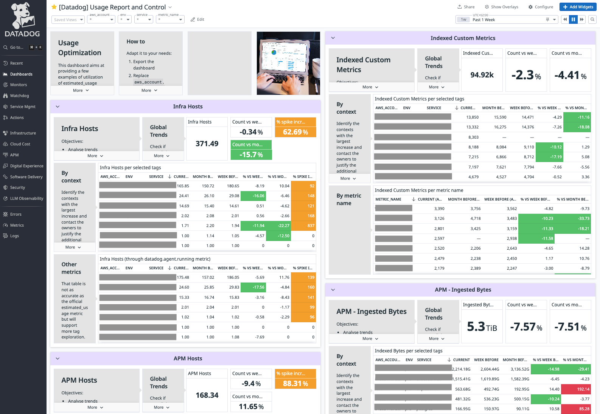

# Datadog Usage Reporting Dashboard

## Overview

This dashboard helps identify usage outliers and optimize your Datadog resource consumption across your infrastructure. It provides comprehensive monitoring and analysis of your Datadog resource usage, helping you:

- Track infrastructure host usage
- Analyze usage trends
- Identify anomalies and spikes
- Optimize costs
- Monitor week-over-week changes



## How to Use

### Before import

The current dashboard uses 3 tags to breakdown usage. Make sure to replace those. The default ones are `cost_center`, `department` and `team`.

### Import (with Terraform)

```hcl
module "datadog_usage_reporting_dashboard" {
  # source = "../../assets/datadog_usage_reporting_dashboard"
  source = "git::https://github.com/nxnarbais/datadog-share.git//assets/datadog_usage_reporting_dashboard?ref=<version_tag>"

  teams = ["team:dataiker"]
  title_suffix = " - Managed by Terraform"
  managed_by_terraform = "managed_by:terraform"

  usage_breakdown_tag_1 = "cost_center"
  usage_breakdown_tag_2 = "department"
  usage_breakdown_tag_3 = "team"
}
```

### Best Practices

1. Select appropriate timeframes for analysis (recommended: > 1 week)
2. Monitor trends regularly
3. Set up alerts for significant usage spikes
4. Review and adjust resource allocation based on insights
