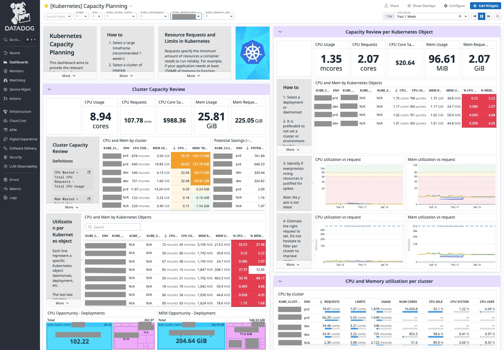

# Kubernetes Capacity Planning Dashboard

## Overview

This dashboard is designed to help Kubernetes administrators and users optimize their resource allocation by identifying potential overprovisioning of CPU and Memory resources. By analyzing the actual usage versus requested resources, teams can make informed decisions about resource allocation and potentially reduce costs.



## How to Use

### Before import

The current dashboard uses an estimate of $10/cpu_core/month. Replace if needed.

### Import (with Terraform)

```hcl
module "kubernetes_capacity_planning_dashboard" {
  source = "../../assets/kubernetes_capacity_planning_dashboard"

  teams = ["team:dataiker"]
  title_suffix = " - Managed by Terraform"
  managed_by_terraform = "managed_by:terraform"

  cost_per_cpu_core_per_month = 10
}
```

### When exploring

1. **Select Timeframe**
   - Choose a timeframe of at least one week for meaningful analysis
   - Longer timeframes help identify usage patterns and spikes

2. **Filter by Cluster**
   - Select specific clusters to analyze
   - Compare resource utilization across different environments

3. **Analyze Kubernetes Objects**
   - Focus on specific deployments or daemonsets
   - Review resource utilization patterns
   - Identify overprovisioned resourcesåå

4. **Optimize Resource Requests**
   - Use the utilization graphs to determine optimal resource requests
   - Consider peak usage patterns when setting requests
   - Balance between resource availability and cost efficiency

## Cost Optimization

The dashboard includes calculations for potential cost savings:

- CPU core savings estimation (~$10 per CPU core per month)
- Memory optimization opportunities
- Resource wastage identification

## Best Practices

1. **Resource Requests**
   - Set requests based on actual usage patterns
   - Consider peak usage when determining requests
   - Monitor utilization over time

2. **Resource Limits**
   - Set limits to prevent resource exhaustion
   - Consider application requirements
   - Monitor for limit hits

3. **Regular Review**
   - Schedule regular capacity planning reviews
   - Update resource allocations based on usage patterns
   - Consider seasonal variations in usage
