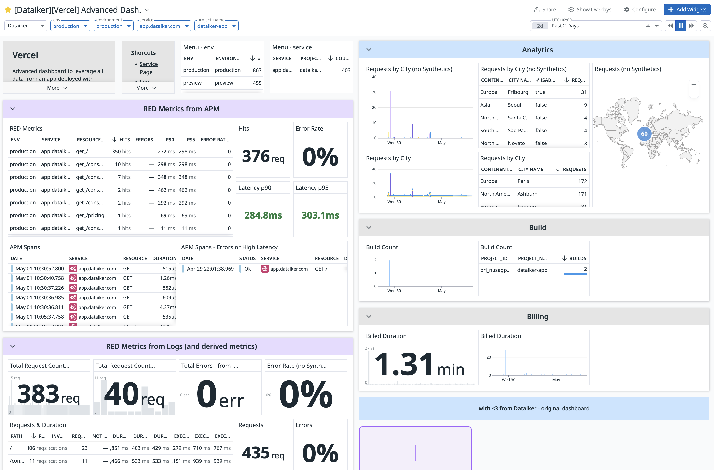

# Vercel Dashboard

## Overview

This dashboard provides comprehensive monitoring and analytics for applications deployed on Vercel. It helps track performance, usage patterns, and potential issues across your Vercel deployments.



## How to Use

### Before import

The dashboard uses several template variables that you can customize:
- `env`: Environment filter (default: "*")
- `environment`: Environment filter (default: "*")
- `service`: Service name filter (default: "*")
- `project_name`: Project name filter (default: "*")

### Import (with Terraform)

```hcl
module "vercel_dashboard" {
  # source = "../../assets/vercel_dashboard"
  source = "git::https://github.com/nxnarbais/datadog-share.git//assets/vercel_dashboard?ref=<version_tag>"

  teams = ["team:dataiker"]
  title_suffix = " - Managed by Terraform"
  managed_by_terraform = "managed_by:terraform"

  latency_p90_threshold = 1000  # in milliseconds
  latency_p95_threshold = 2000  # in milliseconds
}
```

### When exploring

1. **Select Timeframe**
   - Choose a timeframe that suits your analysis needs
   - Longer timeframes help identify usage patterns and trends

2. **Filter by Environment**
   - Use the environment dropdown to focus on specific environments
   - Compare performance across different environments

3. **Monitor Key Metrics**
   - Track request counts and error rates
   - Monitor latency (p90, p95)
   - Analyze build statistics
   - Review billing metrics

## Dashboard Sections

### RED Metrics from APM
- Request counts
- Error rates
- Latency percentiles
- APM spans and traces
- Error and high latency spans

### RED Metrics from Logs
- Request counts (with and without synthetics)
- Error tracking
- Duration metrics
- Status code analysis
- Path-based metrics

### Analytics
- Geographic distribution of requests
- City-based request analysis
- Continent-level breakdown
- User type analysis (admin/non-admin)

### Build
- Build count tracking
- Project-based build statistics
- Build success/failure rates

### Billing
- Billed duration tracking
- Cost analysis
- Resource utilization

## Best Practices

1. **Performance Monitoring**
   - Set appropriate latency thresholds
   - Monitor error rates regularly
   - Track resource utilization

2. **Cost Optimization**
   - Review billed duration
   - Analyze build frequency
   - Optimize resource allocation

3. **Geographic Analysis**
   - Monitor request patterns by region
   - Identify potential performance issues
   - Optimize content delivery

## Contributing

Feel free to contribute to this dashboard by:
1. Forking the repository
2. Creating a new branch
3. Making your improvements
4. Submitting a pull request
